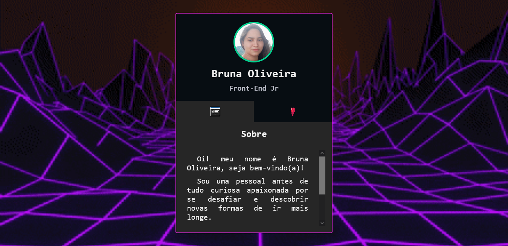

# miniPortifolio

Projeto construído no Evento Mapa Dev Week do DeveemDobro.

[🔗 Acesse aqui](https://bruna-luc.github.io/miniPortifolio
/)

## Objetivos 
  Desenvolver um card como algumas informações.

## 📚 Tecnologias 
- HTML;
- CSS;
- JavaScript.

## 😁 Contato
bruna.o.fonseca@hotmail.com
